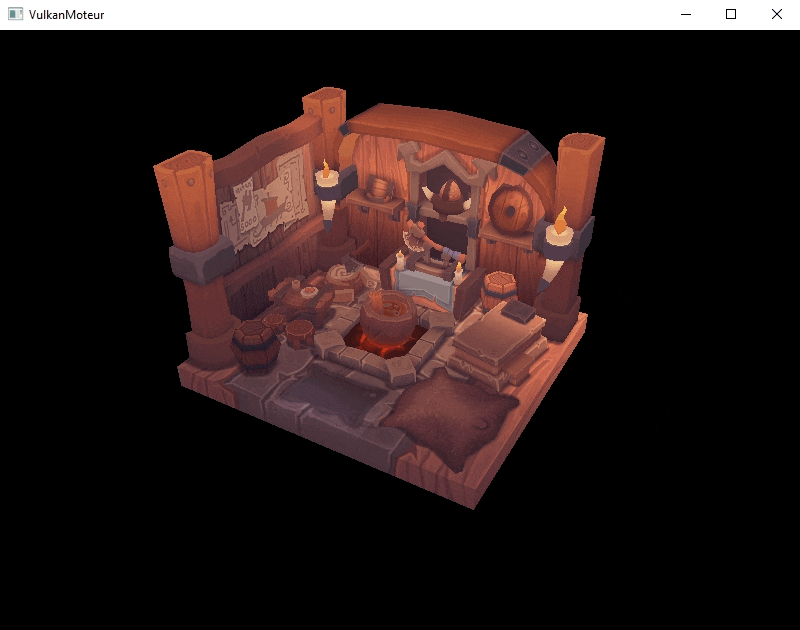
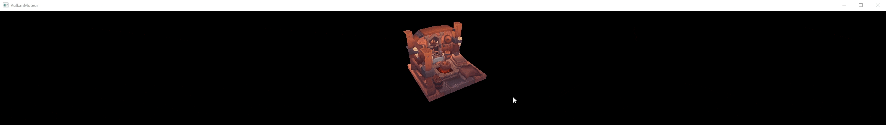
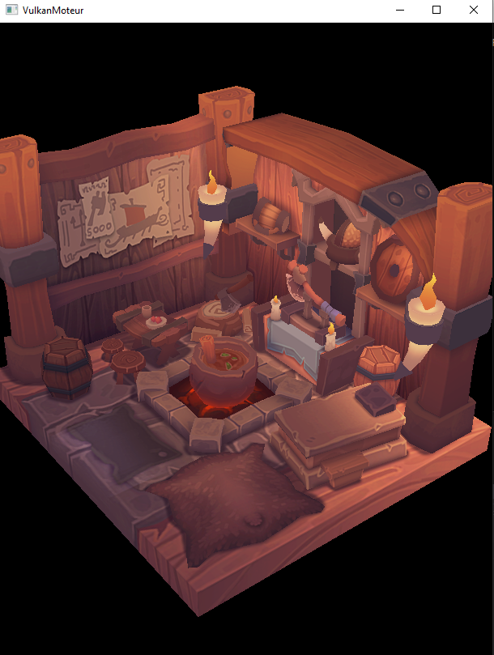
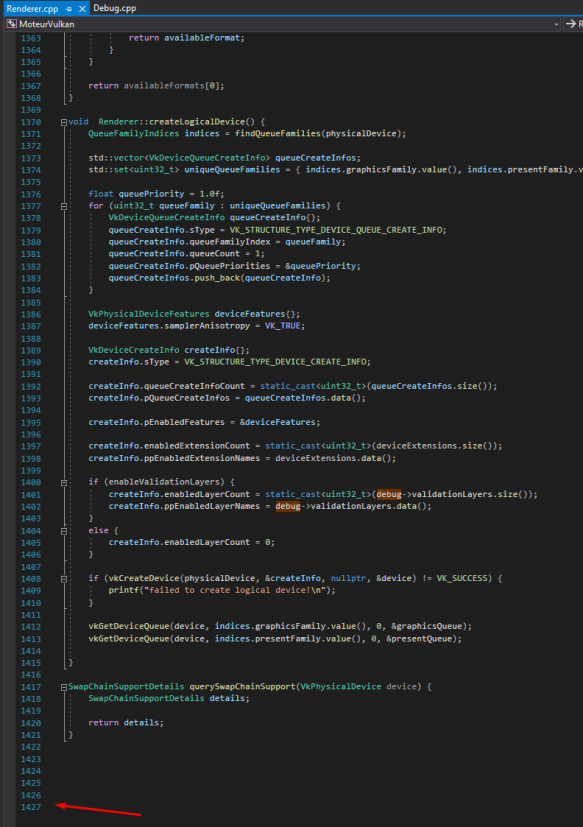
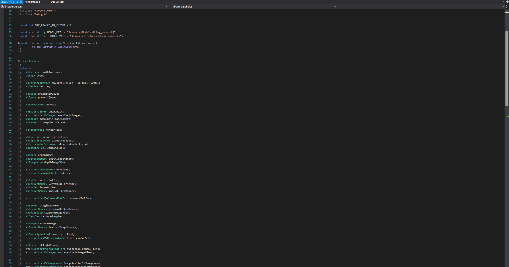
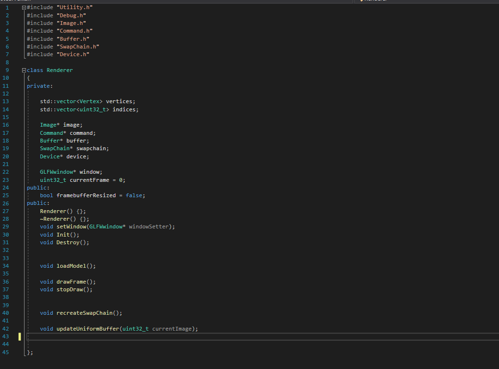
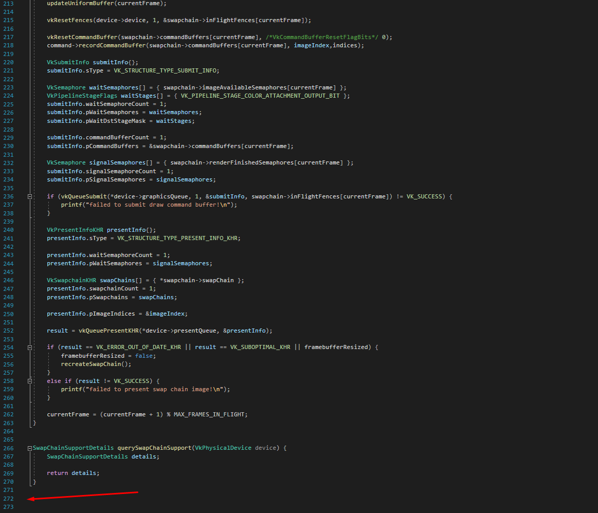

## MOTEUR - VULKAN API

The purpose of the project is to build a Engine on Vulkan.

## FEATURES
- This engine is pretty basic and can only load 3d obj files
and textures on that said object
	 
	

### Other thing!
works in different windows size too!

## Difficulties during this projects

I tried to refactor the project to make it easier to code in the future, and have a clean structure

What I have :

What I tried to have:

Sadly I couldnt make it work (in time)

My computer also died the day where we were stuck at home because of the national strike, which made me more behind on my work...

## AUTHORS
DECHAUX Yann        -   (y.dechaux@student.isartdigital.com)